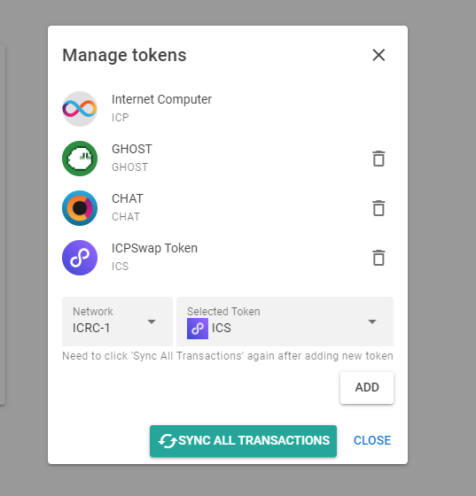

# 📋 Synchronized Transaction


In order to support IRCR1 tokens, TallyLint no longer supports wallet in the form of Account ID, only Principal ID entered into wallet are supported now.


## How to get NNS wallet Principal ID

### Step

1. Log in NNS ([https://nns.ic0.app/](https://nns.ic0.app/))
2.  Select any ICRC1 token(Not Internet Computer), e.g. Chat

    <figure><figcaption>
Click anyone
</figcaption></figure>
3.  Copy the address in the upper right corner

    <figure><figcaption>
Click the button on the right
</figcaption></figure>

## How to synchronize transaction history

Select the ICRC1 tokens you want to synchronize

### Step

1. Click 'Sync All Wallets' Button
2. Select the tokens you want to synchronize transaction history with and click the ADD button.
3. After adding all the tokens for which you want to synchronize the transaction history, click the “Synchronize all wallets” button under the current window.
4. When synchronization is complete, you can view all the transactions you have synchronized on the Transactions page.
